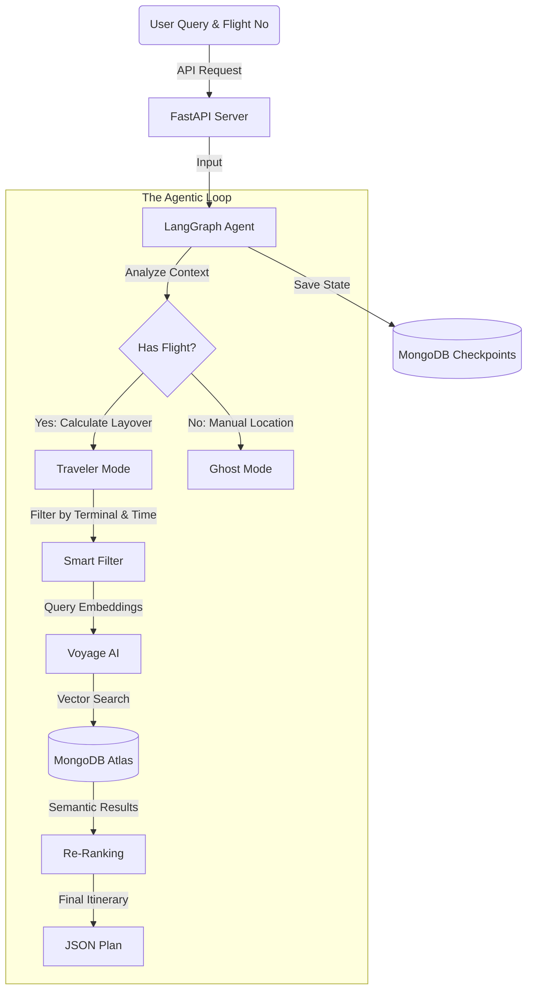

Apologies for the confusion. Here is the **exact, complete code** for your `README.md`.

You can copy this entire block directly into your file. It includes the beautiful badges, the Mermaid diagram code (which GitHub will render automatically), and the specific 6-Phase breakdown you requested.

```markdown
# ✈️ LayoverOS


> **"The operating system for stranded travelers."**

**LayoverOS** is a resilient, autonomous AI agent that turns travel disruptions into curated experiences. Built on **MongoDB Atlas Vector Search** and **LangGraph**, it connects a "Brain" (Reasoning) to a "Memory" (Database) to help stranded travelers navigate complex journeys.

---

## 🧠 The Problem
Current travel apps are **static**. They show you a map, but they don't understand *context*.
* **The Gap:** A generic map shows you a steakhouse 20 minutes away when you only have a 40-minute layover.
* **The Disruption:** If your flight is delayed by 3 hours, your entire plan needs to change instantly.
* **The Solution:** LayoverOS acts as a **State-Persistent Agent** that combines **Flight Telemetry** + **User Preferences** (e.g., "Vegan", "Lactose Intolerant") + **Airport Location Data** to build a dynamic recovery plan.

---

## 🌟 Demo Walkthrough: The Multi-Leg Journey
*User Story: A traveler flying **SFO → DEN → JFK**. The flight is in the morning, the user is Lactose Intolerant, and they have a layover at DEN.*

### 🟢 Phase 1: The Perfect Plan (Pre-Disruption)
The agent analyzes the itinerary and builds a schedule based on time of day and dietary needs:
1.  **Morning (SFO - Departure):** Agent detects "Morning" + "Lactose Intolerant."
    * *Recommendation:* **Peet's Coffee (Terminal 3)** - Specifically highlights their oat milk availability.
2.  **Afternoon (DEN - 3 Hr Layover):** Agent detects "Lunchtime" + "Vegan."
    * *Recommendation:* **Root Down (Concourse C)** - Flagged for its high-rated farm-to-table vegan options.
3.  **Night (JFK - Arrival):** Agent detects "Late Arrival."
    * *Recommendation:* Suggests a quick grab-and-go dinner near the exit to maximize rest.

### 🔴 Phase 2: The Disruption (Dynamic Reshaping)
*Event: The connecting flight from DEN to JFK is delayed by 4 hours.*
* **Agent Reaction:** Instantly scraps the lunch plan.
* **New Context:** "User now has 7 hours at DEN."
* **New Plan:** "Since you have time, I have located the **Capital One Lounge** for work and the **Sleeping Pods** in Concourse A so you can get deep rest before the redeye."

---

## 🏗️ System Architecture

We built an **AI Multi-Agent Backend** that connects a "Brain" (LangGraph Agent) to a "Memory" (MongoDB Atlas).



---

## 🛠️ Implementation Phases

### 📅 Phase 1: The Foundation (Setup)

* **Environment:** Set up a Python backend with `FastAPI`, `LangGraph`, `Voyage AI`, and `PyMongo`.
* **Database:** Connected to **MongoDB Atlas**.
* **Embeddings:** Configured **Voyage AI (voyage-3-large)** to convert text into vectors for semantic search.

### 🛫 Phase 2: Authentic Data Generation (The "Knowledge")

We didn't want fake data, so we generated **High-Fidelity Mock Data**:

* **SFO Data:** Created `generate_authentic_data.py` to generate 160+ real SFO amenities (e.g., "Amy's Drive Thru", "Yoga Room") with strict location tags like "SFO Terminal 1".
* **Multi-Airport:** Created `generate_airports.py` to add **DEN** (Denver) and **JFK** (New York) amenities.
* **Ingestion:** Wrote `ingest_data.py` to:
1. Read the JSON files.
2. Generate Embeddings via Voyage AI.
3. Upload ~300 documents to the `layover_os.amenities` collection in MongoDB.


### 🔍 Phase 3: The Search Engine (Vector Search)

* **Vector Index:** Created a specific **Atlas Search Index** (`vector_index`) in the MongoDB UI.
* **Hybrid Filter:** Configured it to assume:
* `embedding`: For semantic similarity (e.g., "Find me a place to sleep").
* `terminal_id` & `airport_code`: For strict filtering (e.g., "ONLY in SFO Terminal 1").


### ✈️ Phase 4: Flight Intelligence (The "Context")

* **Flight Database:** Created `mock_flights.json` with robust scenarios:
* `UA405`: Cancelled flight (Stranded).
* `UA400`: Tight connection (90 mins).
* `LH455`: 3-hour Delay (International Terminal).


* **Flight Integration:** Wrote `ingest_flights.py` to upload these flights to a separate `layover_os.flights` collection.
* **Data Mismatch Fix:** We realized flight terminals ("Terminal 3") didn't match amenity terminals ("SFO Terminal 3"). We ran a mass update to standardize everything to the full ID format so they connect perfectly.

### 🧠 Phase 5: The Agent (The "Brain")

**LangGraph Architecture (`agent.py`):** We built a state machine with two main nodes:

1. **`analyze_context`**: Looks at User Input.
* If `flight_id` is present (e.g., "UA405"), it switches to **Traveler Mode**. It calculates the layover time (e.g., "Cancelled" = 6 hours) and finds the correct terminal.
* If no flight, it defaults to **Ghost Mode** (manual location).


2. **`find_amenities`**: Takes that context and generates a **Smart Query**.
* Context: "6 hour delay" -> Query: "comfortable sleeping pods, rest areas".
* Context: "45 min connection" -> Query: "quick grab and go food".
* **Hybrid Search:** The agent executes the search against MongoDB, combining the Vector embedding (for relevance) with the `terminal_id` filter (for location accuracy).


### 🚀 Phase 6: The API & Deployment

* **FastAPI (`main.py`):** We wrapped the AI Agent in a robust API Server so your frontend can talk to it via `POST /agent/chat`.
* **GitHub Ready:** Included a `.gitignore` to protect secrets (`.env`) and wrote this Professional README with badges and setup instructions.

---

## 🚀 Getting Started

### 1. Clone the Repository

```bash
git clone [https://github.com/ShachiMistry/LayoverOS.git](https://github.com/ShachiMistry/LayoverOS.git)
cd LayoverOS

```

### 2. Set up Environment

```bash
python -m venv venv
source venv/bin/activate  # On Windows: venv\Scripts\activate
pip install -r requirements.txt

```

### 3. Configure Secrets

Create a `.env` file in the `backend/` directory:

```ini
MONGODB_URI=mongodb+srv://<user>:<password>@cluster0.mongodb.net/?retryWrites=true&w=majority
VOYAGE_API_KEY=voyage-01-xxxxxxxx

```

### 4. Run the Data Ingestion (One-Time Setup)

```bash
# Upload 300+ Amenities (SFO, DEN, JFK)
python backend/scripts/ingest_data.py

# Upload Robust Flight Scenarios
python backend/scripts/ingest_flights.py

```

### 5. Start the Server

```bash
cd backend
uvicorn main:app --reload

```

*Access the Swagger UI at `http://localhost:8000/docs*`

---

## 📂 Project Structure

```text
layover-os/
├── backend/
│   ├── agent.py            # The LangGraph Brain (State Machine)
│   ├── main.py             # FastAPI Endpoints
│   ├── data/
│   │   ├── sfo_authentic.json  # Real amenities
│   │   └── mock_flights.json   # 17 Flight Scenarios
│   └── scripts/
│       ├── ingest_data.py      # Vector Embedding Pipeline
│       └── generate_data.py    # Synthetic Data Generator
├── .gitignore              # Security (Protects .env)
├── requirements.txt        # Dependencies
└── README.md               # Documentation

```

---

*Built with ❤️ for the MongoDB Agentic Hackathon 2026.*

```

```
