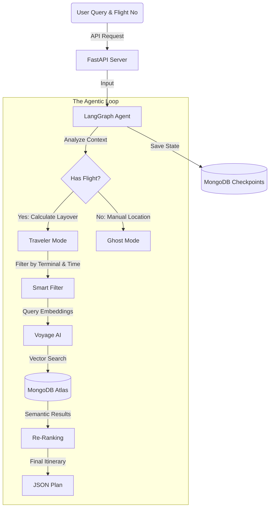

Here is a complete, competition-grade `README.md` file. It incorporates all your phases, your architecture, and your specific "Multi-Leg Journey" scenario into a professional format.

**Copy the code block below completely and paste it into your `README.md` file.**

---

```markdown
# ✈️ LayoverOS


> **"The operating system for stranded travelers."**

**LayoverOS** is a resilient, autonomous AI agent that turns travel disruptions into curated experiences. Built on **MongoDB Atlas Vector Search** and **LangGraph**, it doesn't just search for coffee—it understands *time*.

Whether you have a 45-minute sprint or a 6-hour delay, LayoverOS dynamically reshapes your itinerary in real-time, working across multiple airports (SFO, DEN, JFK) to ensure you are never lost, hungry, or bored.

---

## 🧠 The Problem
Current travel apps are **static**. They show you a map, but they don't understand *context*.
* **The Problem:** A generic map shows you a steakhouse 20 minutes away when you only have a 40-minute layover.
* **The Gap:** If your flight is delayed by 3 hours, your entire plan needs to change instantly.
* **The LayoverOS Solution:** An agent that combines **Flight Telemetry** + **User Preferences** (e.g., "Vegan", "Lactose Intolerant") + **Airport Location Data** to build a dynamic "Pre-Plan."

---

## 🌟 Key Scenarios (The "Golden Path")

### 🛫 Scenario 1: The Multi-Leg Journey (SFO → DEN → JFK)
*User Context: "I am flying SFO to JFK with a layover in Denver. I am lactose intolerant and vegan."*

1.  **Morning (SFO):** Agent detects "Morning Departure." Recommends **Peet's Coffee** (Terminal 3) with oat milk options.
2.  **Afternoon (DEN - 3 Hr Layover):** Agent detects "Mid-Day" + "Vegan." Recommends **Root Down** (Concourse C) for a farm-to-table vegan lunch.
3.  **Night (JFK - Arrival):** Agent detects "Evening Arrival." Suggests a quick dinner spot near the exit or a ride-share pickup zone.

### ⚠️ Scenario 2: The Disruption (Dynamic Reshaping)
*Event: The flight to JFK is delayed by 4 hours.*
* **Agent Reaction:** Instantly scraps the lunch plan.
* **New Plan:** "Since you now have 7 hours at DEN, I have booked you a spot at the **Capital One Lounge** and found the **Sleeping Pods** in Concourse A so you can rest."

---

## 🏗️ System Architecture

We built a **State-Persistent Multi-Agent System** where MongoDB Atlas acts as the "Brain" (Vector Memory) and the "Hippocampus" (State Checkpoints).



### 🔧 The "Stack" (Under the Hood)

* **Backend:** FastAPI & Python
* **Orchestration:** LangGraph (State Machine for context switching)
* **Database:** MongoDB Atlas (Vector Search + Flight Data Collections)
* **Embeddings:** Voyage AI (`voyage-3-large`) for high-fidelity semantic understanding.
* **Data Quality:** Custom generated datasets for SFO, DEN, and JFK using `generate_authentic_data.py` to ensure real terminal IDs ("SFO Terminal 3") match flight data.

---

## 🚀 Getting Started

### 1. Clone the Repository

```bash
git clone [https://github.com/ShachiMistry/LayoverOS.git](https://github.com/ShachiMistry/LayoverOS.git)
cd LayoverOS

```

### 2. Set up Environment

```bash
python -m venv venv
source venv/bin/activate  # On Windows: venv\Scripts\activate
pip install -r requirements.txt

```

### 3. Configure Secrets

Create a `.env` file in the `backend/` directory:

```ini
MONGODB_URI=mongodb+srv://<user>:<password>@cluster0.mongodb.net/?retryWrites=true&w=majority
VOYAGE_API_KEY=voyage-01-xxxxxxxx

```

### 4. Run the Data Ingestion (One-Time Setup)

We generated high-fidelity mock data to simulate a real airport environment.

```bash
# Upload 160+ Amenities (SFO, DEN, JFK)
python backend/scripts/ingest_data.py

# Upload Robust Flight Scenarios (Delays, Cancellations)
python backend/scripts/ingest_flights.py

```

### 5. Start the Server

```bash
cd backend
uvicorn main:app --reload

```

*Access the Swagger UI at `http://localhost:8000/docs*`

---

## 📂 Project Structure

```text
layover-os/
├── backend/
│   ├── agent.py            # The LangGraph Brain (State Machine)
│   ├── main.py             # FastAPI Endpoints
│   ├── data/
│   │   ├── sfo_authentic.json  # Real amenities
│   │   └── mock_flights.json   # 17 Flight Scenarios
│   └── scripts/
│       ├── ingest_data.py      # Vector Embedding Pipeline
│       └── generate_data.py    # Synthetic Data Generator
├── .gitignore              # Security (Protects .env)
├── requirements.txt        # Dependencies
└── README.md               # Documentation

```

---

## 🏆 Hackathon Implementation Details

### Phase 1: The Foundation

We established a connection between **Voyage AI** and **MongoDB Atlas** to enable semantic search capabilities, moving beyond simple keyword matching.

### Phase 2: Authentic Data Generation

We realized generic data wasn't enough. We built specific scripts to generate:

* **160+ Real Amenities:** Mapped to specific terminals (e.g., "SFO Terminal 1").
* **Standardized IDs:** Ran mass updates to ensure flight terminal data matches amenity location tags perfectly.

### Phase 3: Flight Intelligence

We integrated a flight database capable of simulating:

* **UA400:** Tight connection (90 mins) -> Triggers "Grab & Go" logic.
* **UA405:** Cancelled flight -> Triggers "Hotel/Lounge" logic.
* **LH455:** International Delay -> Triggers "Showers/Sleep" logic.

---

*Built with ❤️ for the MongoDB Agentic Hackathon 2026.*

```

```
