<div align="center">
  <br />
    <a href="https://youtu.be/LJ3RjfkfUk0" target="_blank">
      
    </a>
  <br />
  <br />

  <h1 align="center">LayoverOS</h1>
  <p align="center">
    <strong>The First Context-Aware Operating System for Modern Travel</strong>
  </p>

  <p align="center">
    
    
    
    
  </p>
</div>

---


## 🛑 The Problem: Airports are "Dead Zones"

We spend **4.5 billion hours** annually waiting in airports. 
Currently, the experience is fragmented:
1.  **Static Maps:** Blueprints that don't know who you are or what you like.
2.  **Disconnected Data:** Flight apps tracking planes, Yelp tracking food, but nothing connecting the two.
3.  **Cognitive Load:** Trying to find a quiet spot with an outlet and good coffee in a new terminal is a research project.

Airports shouldn't be valid "waiting rooms." They should be **responsive environments**.

---

## ⚡️ The Solution: LayoverOS

**LayoverOS** is not a chatbot. It is an **Agentic Coordinator** that sits between the traveler and the airport's infrastructure.

It transforms a static location ("I am at SFO") into a dynamic set of actionable opportunities.
*   *"I have 2 hours"* → Agent finds a lounge.
*   *"My flight is delayed"* → Agent suggests a sleeping pod near the new gate.
*   *"I'm hungry"* → Agent filters for open restaurants in *your* terminal, using Vector Search to match your preferences (e.g., "healthy," "fast").

### Key Differentiator: "Agent-Driven UI"
Unlike standard apps where users click buttons to trigger code, **LayoverOS reverses the flow**. The AI Agent decides when to trigger UI elements.
*   **Example:** When the user agrees to book a lounge, the **Agent** (backend) sends a command to the **Frontend** to open the Payment Modal securely. The interface adapts to the conversation.

---

## 🏗 Technical Architecture

We built a sophisticated **multi-agent system** orchestrated by **LangChain/LangGraph**, using **MongoDB Atlas** as the central nervous system.

```mermaid
graph TD
    User[Traveler] -->|Chat Input| API[FastAPI Gateway]
    API --> Supervisor[🤖 Supervisor Node]
    
    Supervisor -->|Intent: Search| Scout[🔍 Scout Node]
    Supervisor -->|Intent: Flight| Tracker[✈️ Flight Node]
    Supervisor -->|Intent: Pay| Bursar[💳 Bursar Node]
    
    subgraph "The Brain (MongoDB Atlas)"
        Scout <-->|Vector Search| VStore[(Atlas Vector Store)]
        Supervisor <-->|Read/Write State| Memory[(Checkpoint Saver)]
    end
    
    Scout -->|RAG Context| LLM[Llama 3 Instruct]
    Bursar -->|Trigger| Client[Frontend Payment UI]
```



### 1. The "Hippocampus": MongoDB Atlas
We utilize MongoDB for two critical functions, making the agent "stateful" and "smart":
*   **Vector Search (Semantic Retrieval):** We embedded 160+ airport amenities using **Voyage AI**. When a user asks "find a quiet place to work," we don't look for keywords. We compare the cosine similarity of "quiet work" against the *vibe* of amenities (embedding description) to find the nearest match.
*   **Graph Checkpointing (Long-Term Memory):** Using `MongoDBSaver` with LangGraph, we persist the entire agent state (conversation history, current airport context, flight details) to Atlas. This means a user can lose WiFi, reload the page, or switch devices, and the Agent remembers exactly where they left off.

### 2. The "Cortex": LangGraph & Llama 3
We moved beyond simple "prompt engineering" to **Flow Engineering**.
*   **Supervisor Node:** Uses Regex and NLU to route traffic. It detects context switches (e.g., user flew from SFO to JFK) and updates the global state `airport_code` variable seamlessly.
*   **Scout Node:** Handles RAG (Retrieval Augmented Generation). It has a "Concierge Mode" fallback—if a query is too vague ("I'm hungry"), it asks for clarification ("Which terminal?") *before* wasting tokens on a search.

### 3. The "Face": Next.js & Generative UI
*   **Framework:** Next.js 14 (App Router).
*   **Visuals:** Tailwind CSS with a custom "Cyber-Industrial" design system.
*   **Interactive Blueprint:** Built a custom Scalable Vector Graphic (SVG) map engine that supports pan/zoom interactions via Framer Motion, plotting the user's location in real-time.

---

## 🚀 How to Run

### Prerequisites
*   Python 3.10+
*   Node.js 18+
*   MongoDB Atlas Cluster (M0 or higher)

### 1. Backend Setup
```bash
cd backend
python3 -m venv venv
source venv/bin/activate
pip install -r requirements.txt

# Create .env file with:
# MONGO_URI=...
# FIREWORKS_API_KEY=...
# VOYAGE_API_KEY=...

python3 api.py
# Server runs on http://localhost:8000
```

### 2. Frontend Setup
```bash
cd frontend
npm install
npm run dev
# Dashboard available at http://localhost:3000
```

---

## 🔮 Future Roadmap

1.  **Biometric Gate Integration:** Using FaceID to associate the user session with their physical ticket at the gate.
2.  **Multi-Modal Vision:** Allow users to snap a photo of a menu to translate it and check for allergens using Llama 3.2 Vision.
3.  **Cross-Airport Handover:** passing the agent state from "Departure Agent" to "Arrivals Agent" automatically upon landing.

---

<div align="center">
  <p>Built with ❤️ for the MongoDB AI Hackathon</p>
</div>
